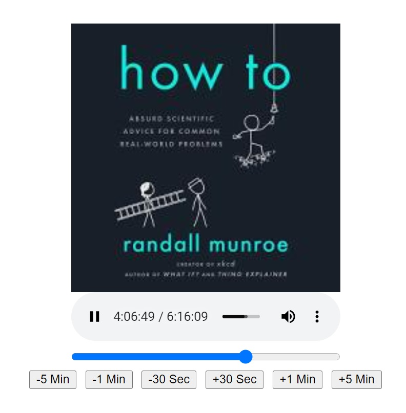

# openaudible-player
After you use Open Audible to make a webpage of your collection, you can put this player in the webpage directory to listen to the books. You also have to replace openaudible.js in the assets directory with the one in this repo to make the red "mp3" link open the new player.

This page expects 
*  your mp3 files to be in the form bookname.mp3 in the mp3 directory
*  your thumbnail files to be in the form bookname.jpg in the thumb directory
These are where openaudible puts them when you create a webpage.

To use this player, call it with the bookname

     player.html?play=bookname

